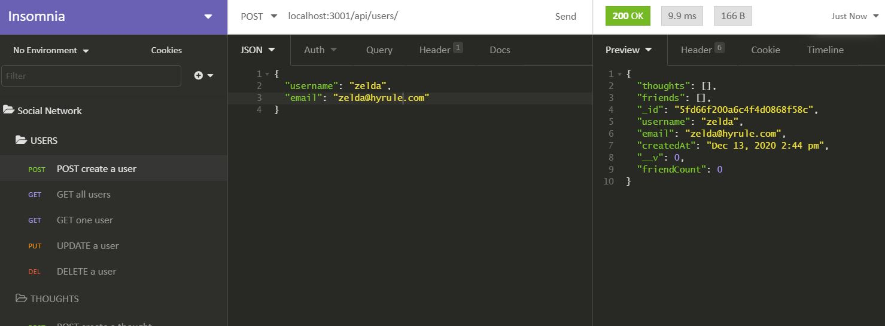
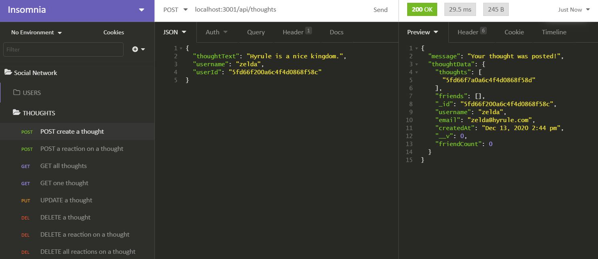
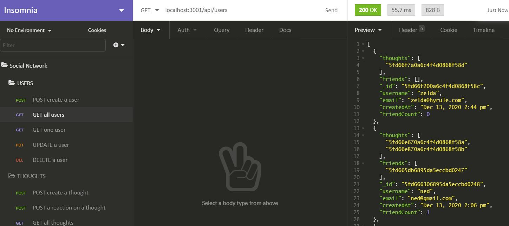
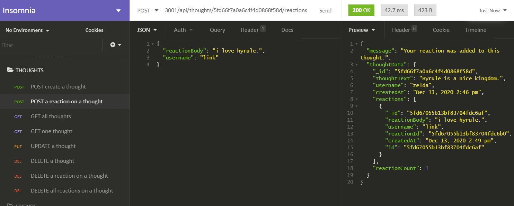
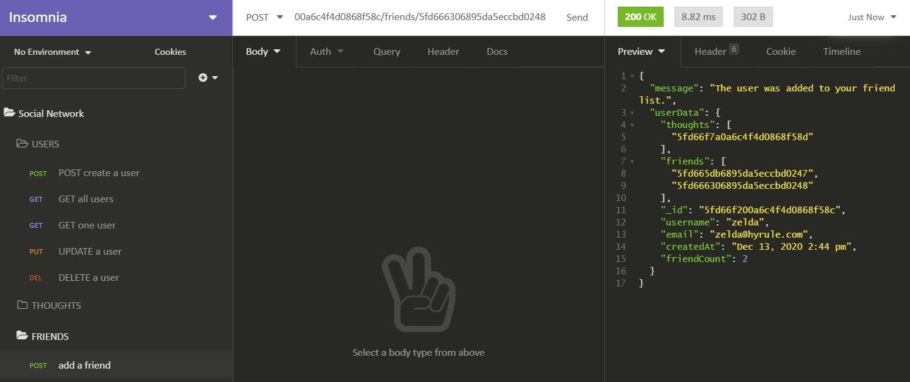

# Social Network App RESTful API (Back-end) 

## Description
This is a RESTful API back-end for a social network application using MongoDB as the NoSQL database along with Mongoose as the ODM. Node.js is used with Express.js for the server and Day.js is used for formatting date and time. There is currently no front-end functionality for this app so routes are demonstrated below using InsomniaCore.

Users can post a thought, add a reaction to another user's thought, and add another user to their friend list. 
Users can also update their info, remove friends from their friend list, update or delete thoughts they posted and remove reactions from other user's thoughts. Users can also be deleted.

#### Creating a new User:

#### Creating a Thought made by a User:

#### Get all Users:

#### Adding a Reaction to a Thought:

#### Adding a Friend to a User's friend list:

## Table of Contents
- [Installation](#installation)
- [Tech Used](#tech-used)
- [Questions](#questions)
- [Links](#links)
- [License](#license) 

## Installation
- Both Node.js and MongoDB must be installed on your machine.
- Clone the repo by copying and pasting in your terminal: 
    - `git clone git@github.com:tchestnut85/social-network.git`
- Navigate to the root directory and run: 
    - `npm install`
- To start the application and server with Nodemon, run the following in your terminal: 
    - `npm run watch`

## Tech Used
- JavaScript
- [Node.js](https://nodejs.org/en/)
- [Express.js](https://www.npmjs.com/package/express)
- [MongoDB](https://docs.mongodb.com/manual/)
- [Mongoose](https://mongoosejs.com/)
- [Nodemon](https://www.npmjs.com/package/nodemon)
- [Day.js](https://www.npmjs.com/package/dayjs)
- [Insomnia Core](https://insomnia.rest/products/core/) (for testing purposes)

## Questions
Please visit my **[GitHub profile](https://github.com/tchestnut85/)** to check out this and other projects I've created and contributed to.
If you have any specific questions about this project, please contact me at <tchestnut85@gmail.com>.

## Links
- **[Demo Video](https://youtu.be/NXepIg0EKCs)**
- **[GitHub Repo](https://github.com/tchestnut85/social-network)**
- **[My Portfolio](https://tchestnut85.github.io/)**

## License

This app is licensed under the MIT license.